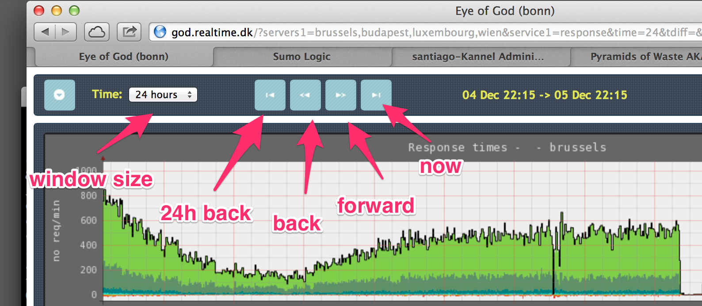

Eye-of-God:  A Server surveillance system. -- Version 2.0, July 2011
======================================================================

Eye-of-god is server surveillance / monitor system build with simplicity in mind.
It's not a new alarm system, it's not capable of sending mails or messages of
any kind. If you need this - have a look at "Nagios" or similar systems.

Eye-of-god is a "rrdtool" centric tool. Tobias Oetiker's rrdtool is the heart
of the system, to store data and to draw data. Reading documentation about rrdtool
is highly recommended !

Throughout this document eye-of-god will be shorten EOG (or sometimes just "god" :-).

Keywords for developing EOG :

* Very simple installation / configuration / maintenance (No Database !)
* High flexibility in graphing you're data
* Writing/adding scripts to collect data should be very simple.
* Setup of a new service should only require some basic configuration and
  a very simple script, only concentrating about the measured services features.

Requirements 
------------
* Ruby 1.8.7 (1.9.x ?)            (http://www.ruby-lang.org/)
> * rubygems (comes with most ruby installations)
> * json gem
> * yaml
> * erb & cgi (on server)
> * stomp (if stomp driver selected)
> * bunny (if rabbitmq driver 'bunny' selected)
> * facter (on all clients)
* Tobias Oetiker's RRDtool        (http://oss.oetiker.ch/rrdtool/)
  (Developed and testet using 1.4.4 and 1.3.x )
* Apache - or similar web sever
* Unix like systems, Solaris, Linux, OS X, ...
  (Developed on Mac OS X - Production on Solaris 10 - believed to run smoothly on Linux)

Main architecture
------------------
Eye-of-god consists of four main programs working together:

* __collector__ (client): 
> The data-acquisition, runs locally from crontab on all servers,  
> collecting data about services. The collector use custom made scripts
> for each service to collect. The collected data is sent to the server 
> using a "driver". Currently only 'queue' drivers are implemented.
> * bunny : RabbitMq driver
> * sqs : Amazon SQS driver
> * stomp : ActiveMq (RabbitMQ with stomp interface) driver, not fully funtional ?

* __godd__ (server):
> The receiver runs on the server on regular intervals from crontab.
> The main purpose is to receive data collected on god clients, and
> store these data in RRD database files on the server.
> The receiver is also able to receive "status" messages from clients,
> containing configuration data, about tags etc.

* __god__ (cgi/server):
> The presentation part, creating the framework for selecting groups  
> of servers and services, timing etc.

* __eye__ (cgi/server):
> script used by god produce graphs from RRD database files.

Files overview
---------------
With EOG a number of files and directories are deployed on your servers.
Here is a short overview and description of the most important ones.

     +- README               - this file
     +- bin/                 - executable files, collector, helper apps, etc.
     +- cgi/                 - cgi scripts for god and the eye
     +- config/              - important config-files
        +- god.yaml          - main configuration file
        +- <service>.yaml    - configuration for each service to collect data
     +- images/              - various images used by "god"
     +- include/             - Style sheets, templates, java scripts files, etc
     +- rrd/                 - the place to store RRD data files
     +- scripts/             - scripts for collecting data for all services

Other Utilities
------------------
    bin/collect     : Tool to update data-sets at "non-regular" intervals  
    bin/update-eyes : Synchronize all "eyes" (clients) with god (server)  
    bin/update-god  : update god (server) from on of the eye's - (not finished yet)  

Download
---------
You can get the latest version from github at git@github.com/frese/eye-of-god.git

Installation (and a bit of maintenance)
---------------------------------------

You can install EOG almost anywhere you like (I guess), as long as you can 
get apache (or similar web-server) to serve cgi scripts and images from that path.

Here's an example apache configuration :

     Alias /god/ "/..path../god/"
     <Directory "/..path../god">
        Options Indexes
        AllowOverride None
        Order allow,deny
        Allow from all
     </Directory>
     <Directory "/..path../god/cgi">
        Options ExecCGI
        SetHandler cgi-script
     </Directory>

The chosen setup, path, apache conf. etc, should be copied to all servers, no matter
if it's supposed to be used as eye-of-god sever or client. In "god" all servers
are the same. If fact, the philosophy in EOG maintenance, is to make changes to you're
chosen EOG server, and then copy everything (using "update-eyes" script) to all
EOG clients (called "eye's")

This brings us to a simple set of requirements for all this stuff to work ...

* Install to the same user account on all servers.
* Install to same local path on all servers.
* Setup apache (web) configuration the same on all servers.
* Prop. more to come ...

Setup and configuration
------------------------

All configuration files used in EOG, is in "yaml" format, have a look at http://yaml.org. 
(Newest spec. at http://www.yaml.org/spec/1.2/spec.html)

When setting up EOG - start by looking at sample.god.yaml. This is the main configuration
file where you define all groups, clusters, servers, services, urls etc.
The sample file should have plenty of explanation for you to figure out how to set it up.

Apart from god.yaml, you have to setup a configuration file for each service you want
in your surveillance. Again, have a look at the sample files: "sample.cpu.yaml", and
"sample.disk.yaml", they should contain plenty of comments and explanation to setup
some services. Read the next section for some general information about service types
and how to write "service scripts".

Service script & configuration
------------------------------
God operate with two types of services.

__Static:__
> A service where you know exactly how many 'data-sets' you need to measure
> and that will not change. ie. CPU load, look in configuration file "sample.cpu.yaml"
> and the script "sample.cpu.sh".
> A static script outputs exactly one line of data, all measured data-sets separated
> by the specified "separator" in the services yaml conf. file.

__Dynamic:__    
> A service where you don't know exactly the data sets to measure, or if the data
> sets will change over time.   
> A static script output one line for each 'data-set' in the form:
> 
> > label:values  or   
> > label[meta data]:values   
> 
> where label only contain letters (upper case and lower case), numbers and underscore.
> values are separated by the specified "separator" in the services yaml conf. file.   
> For dynamic services (and for static) you can refer to data-set names and meta data
> using the macros {DS} and {META}, when setting up graphs and comments. See examples
> in "sample.disk.yaml". Also color codes can be chosen "randomly" using the macro
> {COLOR}. The color is chosen by a static hash algorithm using the data set name {DS}
> as input. Ie. you will always get the same color, as long as you're data set name
> is constant.

__Graph:__
For each service you can specify a one or more graphs ....

--------------------------------------------------------------------------------------------------------

License
--------
Eye-of-god is under GNU License as described in http://www.gnu.org/copyleft/gpl2.html

